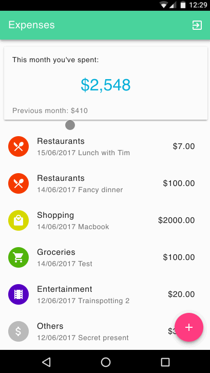
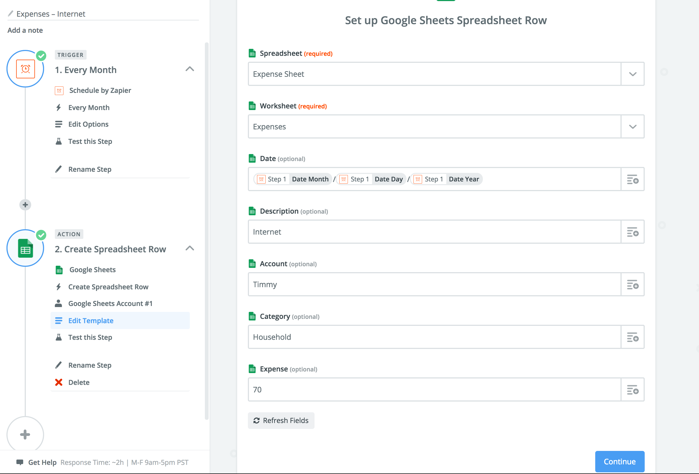

💰Expenses is a [progressive web application](https://developers.google.com/web/progressive-web-apps/) on top of [Google Sheets](https://developers.google.com/sheets/) 📉 written in [React](https://facebook.github.io/react/) ⚛️. It is only a static HTML that works great on mobile 📱 and can be deployed anywhere.

Check out the [demo](https://demo-expenses.chodounsky.net) but please be considerate and don't break it for others.



It was inspired by the [expense-manager](https://github.com/mitul45/expense-manager) by mitul45 and it uses the [material web components](https://material.io/components/) and [material icons](https://material.io/icons/).

## Features

* Multiple accounts
  * Checking, savings, joint, etc.
* Categories
* [Google Sheet](https://docs.google.com/spreadsheets/d/1Lz1_gHIgCKPKhJpFerq9PoNy-TIst7eLZ5plQi5Prv0/edit?usp=sharing) as a backend
  * Great privacy and access control.
  * Don't share sensitive data with 3rd party.
  * Unlimited analysis up to your sheet skill.
* Works great on mobile
  * Progressive Web App. Loads quickly and works as a standalone app.
* Beautiful material design
  * Better than native ;)
* Recurring expenses
  * Totally doable with [Zapier](http://zapier.com/).
* Monthly summary
  * This month. Last month. You immediately know how you doing.

## Get started

You will need a somewhat recent version of [Node](https://nodejs.org/en/) and a place to deploy static HTML under a custom domain (doesn't have to be top level). To get the full offline support with service workers you'll need HTTPS – [CloudFlare](cloudflare.com) works fine or you can use your own certificate.

1) make a copy of [Expense Sheet](https://docs.google.com/spreadsheets/d/1Lz1_gHIgCKPKhJpFerq9PoNy-TIst7eLZ5plQi5Prv0/edit?usp=sharing) to your drive `File -> Make a copy...`
2) note the id of your new sheet (it's part of the URL)
3) clone, install dependencies and build the app:


```
npm i && REACT_APP_SHEET_ID=<replace with your sheet id> npm run build
```

4) copy the content of `build` folder to your server

### Recurring Expenses

Zapier is a service for connecting apps and automating your workflows. And it can be used to add recurring expenses with the [Google Sheets Integrations](https://zapier.com/zapbook/google-sheets/).

Select a trigger – it could be every month, week, or based on anything else.

Use the `Create Spreadsheet Row` integration and select your expense sheet and fill it with the desired values. Easy.



### Sharing

Adding another person (for example your partner) to the app is easy – you just give them access to the expense sheet in Google Sheets.

After that, they have the same access as you are and can add expenses through the same URL.

---

If you like this project – you might also enjoy [React Digest](https://reactdigest.net/) newsletter 🗞. Subscribe to get the top 5 news from React community every week.
